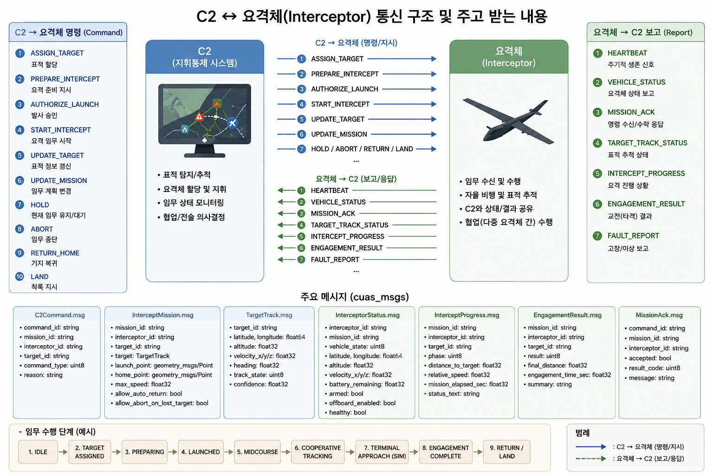

# CUAS C2 ↔ 요격체(Interceptor) 통신 구조 및 메시지 정의



## 1. 전체 시스템 구조

```text
C2 System
  ↕ cuas_msgs
cuas_ros_com
  ↕ px4_msgs
PX4 / Offboard
```

---

# 2. 임무 수행 단계

```text
IDLE
 ↓
TARGET_DETECTED
 ↓
TARGET_ASSIGNED
 ↓
INTERCEPTOR_READY
 ↓
LAUNCH_AUTHORIZED
 ↓
INTERCEPTOR_ACTIVE
 ↓
MIDCOURSE_GUIDANCE
 ↓
COOPERATIVE_TRACKING
 ↓
TERMINAL_APPROACH_SIM
 ↓
ENGAGEMENT_COMPLETE
 ↓
RETURN / HOLD / ABORT
```

---

# 3. C2 → 요격체(Command)

| 명령어 | 설명 |
|---|---|
| ASSIGN_TARGET | 표적 할당 |
| PREPARE_INTERCEPT | 요격 준비 지시 |
| AUTHORIZE_LAUNCH | 발사 승인 |
| START_INTERCEPT | 요격 임무 시작 |
| UPDATE_TARGET | 표적 정보 갱신 |
| UPDATE_MISSION | 임무 계획 변경 |
| HOLD | 현재 임무 유지/대기 |
| ABORT | 임무 중단 |
| RETURN_HOME | 기지 복귀 |
| LAND | 착륙 지시 |

---

# 4. 요격체 → C2(Report)

| 보고 항목 | 설명 |
|---|---|
| HEARTBEAT | 주기적 생존 신호 |
| VEHICLE_STATUS | 요격체 상태 보고 |
| MISSION_ACK | 명령 수신/수락 응답 |
| TARGET_TRACK_STATUS | 표적 추적 상태 |
| INTERCEPT_PROGRESS | 요격 진행 상황 |
| ENGAGEMENT_RESULT | 교전(타격) 결과 |
| FAULT_REPORT | 고장/이상 보고 |

---

# 5. 주요 메시지 정의(cuas_msgs)

## 5.1 C2Command.msg

```text
builtin_interfaces/Time stamp

string command_id
string mission_id
string interceptor_id
string target_id

uint8 command_type

uint8 ASSIGN_TARGET=1
uint8 PREPARE_INTERCEPT=2
uint8 AUTHORIZE_LAUNCH=3
uint8 START_INTERCEPT=4
uint8 UPDATE_TARGET=5
uint8 UPDATE_MISSION=6
uint8 HOLD=7
uint8 ABORT=8
uint8 RETURN_HOME=9
uint8 LAND=10

string reason
```

---

## 5.2 TargetTrack.msg

```text
builtin_interfaces/Time stamp

string target_id

float64 latitude
float64 longitude
float32 altitude

float32 velocity_x
float32 velocity_y
float32 velocity_z

float32 heading
float32 confidence

uint8 track_state

uint8 UNKNOWN=0
uint8 DETECTED=1
uint8 TRACKING=2
uint8 LOST=3
uint8 CONFIRMED=4
```

---

## 5.3 InterceptMission.msg

```text
builtin_interfaces/Time stamp

string mission_id
string interceptor_id
string target_id

cuas_msgs/TargetTrack target

float32 max_speed
float32 safe_altitude
float32 loiter_altitude

float64 launch_latitude
float64 launch_longitude
float32 launch_altitude

float64 home_latitude
float64 home_longitude
float32 home_altitude

bool allow_terminal_phase
bool allow_auto_return
bool allow_abort_on_lost_target
```

---

## 5.4 InterceptorStatus.msg

```text
builtin_interfaces/Time stamp

string interceptor_id
string mission_id

uint8 vehicle_state

uint8 IDLE=0
uint8 READY=1
uint8 ARMED=2
uint8 ACTIVE=3
uint8 HOLDING=4
uint8 RETURNING=5
uint8 LANDED=6
uint8 FAULT=7

float64 latitude
float64 longitude
float32 altitude

float32 velocity_x
float32 velocity_y
float32 velocity_z

float32 battery_remaining
bool armed
bool offboard_enabled
bool healthy
```

---

## 5.5 InterceptProgress.msg

```text
builtin_interfaces/Time stamp

string mission_id
string interceptor_id
string target_id

uint8 phase

uint8 NONE=0
uint8 ASSIGNED=1
uint8 PREPARING=2
uint8 LAUNCHED=3
uint8 MIDCOURSE=4
uint8 COOPERATIVE_TRACKING=5
uint8 TERMINAL_APPROACH_SIM=6
uint8 COMPLETED=7
uint8 ABORTED=8
uint8 FAILED=9

float32 distance_to_target
float32 relative_speed
float32 mission_elapsed_sec

string status_text
```

---

## 5.6 MissionAck.msg

```text
builtin_interfaces/Time stamp

string command_id
string mission_id
string interceptor_id

bool accepted
uint8 result_code

uint8 OK=0
uint8 REJECTED=1
uint8 BUSY=2
uint8 INVALID_TARGET=3
uint8 NOT_READY=4
uint8 SAFETY_BLOCKED=5
uint8 INTERNAL_ERROR=6

string message
```

---

## 5.7 EngagementResult.msg

```text
builtin_interfaces/Time stamp

string mission_id
string interceptor_id
string target_id

uint8 result

uint8 UNKNOWN=0
uint8 SUCCESS_SIM=1
uint8 MISSED_SIM=2
uint8 ABORTED=3
uint8 TARGET_LOST=4
uint8 SYSTEM_FAULT=5
uint8 SAFETY_ABORT=6

float32 final_distance
float32 engagement_time_sec

string summary
```

---

## 5.8 FaultReport.msg

```text
builtin_interfaces/Time stamp

string interceptor_id
string mission_id

uint8 severity

uint8 INFO=0
uint8 WARNING=1
uint8 ERROR=2
uint8 CRITICAL=3

uint16 fault_code
string fault_name
string description

bool requires_abort
```

---

# 6. ROS2 Topic 설계

## C2 → 요격체

```text
/cuas/c2/command
/cuas/c2/mission
/cuas/c2/target_track
```

## 요격체 → C2

```text
/cuas/interceptor/status
/cuas/interceptor/progress
/cuas/interceptor/ack
/cuas/interceptor/result
/cuas/interceptor/fault
```

---

# 7. 다중 요격체 Namespace 예시

```text
/cuas/interceptor/interceptor_001/status
/cuas/interceptor/interceptor_001/progress
/cuas/interceptor/interceptor_001/ack
```

---

# 8. cuas_ros_com 역할

```text
1. C2Command 수신
2. InterceptMission 수신
3. TargetTrack 수신
4. 내부 상태기계 갱신
5. px4_msgs로 변환
   - VehicleCommand
   - OffboardControlMode
   - TrajectorySetpoint
6. InterceptorStatus / Progress / Result를 C2로 publish
```

---

# 9. 메시지 변환 흐름

```text
cuas_msgs/C2Command
        ↓
cuas_ros_com
        ↓
px4_msgs/VehicleCommand
```

```text
cuas_msgs/TargetTrack
        ↓
cuas_ros_com
        ↓
px4_msgs/TrajectorySetpoint
```

---

# 10. 추천 패키지 구조

```text
cuas_ros2_ws/src/
 ├── px4_msgs
 ├── cuas_msgs
 └── cuas_ros_com
     ├── src/
     │   ├── cuas_c2_node.cpp
     │   ├── cuas_offboard_node.cpp
     │   └── cuas_state_machine.cpp
     ├── include/cuas_ros_com/
     │   ├── cuas_state_machine.hpp
     │   └── cuas_types.hpp
     └── launch/
         └── cuas_sih.launch.py
```

---

# 11. 노드 역할

## cuas_c2_node

```text
C2 명령/상태 통신 담당
```

## cuas_offboard_node

```text
PX4 Offboard 제어 담당
```

## cuas_state_machine

```text
임무 상태 전이 및 협업 제어 담당
```

